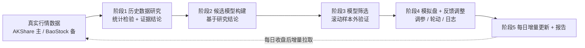

# A股全市场量化研究·模拟分析系统（研究先行版）设计文档

- 日期：2026-08-09
- 状态：待评审
- 性质：纯模拟研究，不构成任何投资建议

## 1. 背景与目标

构建一个基于真实 A 股数据的量化数据分析系统，核心诉求：

1. 数据必须是真实 A 股数据（AKShare / BaoStock 等可信开源数据源）；
2. 先对历史数据做系统性统计/数学建模研究，用数据证据决定最终保留哪些模型，而不是预先拍板；
3. 通过模拟盘验证模型，并通过反馈持续监控与调整（策略内调参 + 策略间轮动）；
4. 每个交易日跟进真实数据（增量更新）；
5. 全程模拟，不实盘、不构成投资建议。

## 2. 范围与非目标

范围内：

- 全 A 股日线行情与基础估值数据；
- 历史数据统计研究（分布、波动聚集、动量/反转、因子有效性、市场状态）；
- 候选模型构建与滚动样本外筛选；
- 统一规则下的模拟回测与绩效评估；
- 反馈监控、自动调参与轮动，含调整日志；
- 每日增量更新与自动执行；
- 交互式 HTML 分析报告。

非目标（初版不做）：

- 实盘交易接口；
- 分钟级/高频策略；
- 新闻舆情/NLP 因子；
- 深度学习路线（Qlib 相关能力留作后续扩展）；
- 任何投资建议或收益保证。

## 3. 总体架构



## 4. 数据层

### 4.1 数据源

- 主数据源：AKShare（免费、MIT、社区活跃）；
- 备用数据源：BaoStock（免费、历史数据稳定）；
- 行情字段：date、open、high、low、close、volume、amount（前复权为主）；
- 估值字段：总市值、PE、PB 等；
- 股票列表：全 A 股，剔除 ST、上市不足 60 个交易日、长期停牌（>20 个交易日）的股票。

### 4.2 时间范围

- 默认近 3 年日线，可配置 1~5 年；
- 全量下载约 5000+ 只股票，耗时较长：支持断点续传、并发限速、失败重试、跳过记录。

### 4.3 存储与缓存

- 本地 Parquet 分区存储（按年/代码）；
- `manifest.json` 记录每只股票已下载区间与数据来源；
- 每日增量：只拉最新交易日数据，校验后追加合并。

### 4.4 数据校验

- 交易日历对齐（沪深共同交易日）；
- 缺失率阈值、重复检测、异常值检查（价格 <= 0、涨跌幅超限）；
- 复权一致性（统一前复权）；
- 校验不通过的股票标记并跳过，报告中记录原因。

### 4.5 快速验证模式

提供"沪深 300 成分股"小宇宙模式（约 300 只），用于在未完成全量下载前跑通全流程开发调试。

## 5. 阶段 1：历史数据研究

原则：先问市场问题，用统计检验回答，再决定建模方向。每项研究产出一条带编号的结论（R1、R2…），供阶段 2 引用。

### 5.1 研究问题与检验方法

| 研究问题 | 检验方法 | 输出 |
| --- | --- | --- |
| 收益是否厚尾、非正态？ | 偏度、峰度、QQ 图、正态性检验 | 收益分布画像 |
| 波动率是否聚集？ | Ljung-Box 检验、ARCH LM 检验 | 波动聚集证据，决定是否用 GARCH 类模型 |
| 动量还是反转？在哪个时间尺度有效？ | 5/10/20/60/120 日持有期分层回测 + IC 扫描 | 动量/反转时间尺度图 |
| 哪些因子稳定有效？ | 各因子 IC、ICIR、分层单调性、分年度稳定性 | 因子有效性总表 |
| 因子是否冗余？ | 因子相关系数矩阵、PCA 解释度 | 因子降维建议 |
| 市场是否存在不同状态？ | 波动率分位划分、状态切换检验（简化 HMM） | 市场状态划分 |

### 5.2 产出

- 《数据研究报告.md》：数据说明、检验方法、结果、编号结论（R1..Rn）、每条结论对建模的含义。

## 6. 阶段 2：候选模型

基于阶段 1 结论构建 5 个候选：

| 编号 | 模型 | 依赖的研究结论 |
| --- | --- | --- |
| M0 | 沪深 300 买入持有（基准） | — |
| M1 | 横截面多因子模型：有效因子加权合成，截面排名选股 | 因子有效性结论 |
| M2 | 动量趋势模型：依据动量效应显著的时间尺度 | 动量/反转扫描结论 |
| M3 | 均值回归模型：超跌反弹逻辑 | 反转效应结论 |
| M4 | 波动率状态模型：高波动期降仓/防守 | 波动聚集与状态划分结论 |

每个模型必须明确：输入数据、决策规则、可调参数、引用的研究结论编号。

## 7. 阶段 3：模型筛选（数据投票）

- 滚动样本外验证（walk-forward）：训练段定参数/权重 → 样本外验证段检验 → 滚动前进；
- 统一评价指标：IC、分层收益、年化收益、年化波动、夏普比率、最大回撤、胜率、换手率、相对基准超额；
- 稳定性检查：分年度表现、分市场状态表现；
- 筛选规则：样本外夏普高于基准、最大回撤可控、参数不过度敏感；
- 最终保留 2~4 个模型，被淘汰模型记录淘汰理由；
- 防过拟合约束：验证段之间不重叠，禁止用验证段信息调参（杜绝数据泄漏）。

## 8. 阶段 4：模拟盘与反馈调整

### 8.1 统一模拟规则

- 月度调仓，持仓 Top N 等权（N 默认 50）；
- T+1：当日买入次日才能卖出；
- 涨跌停当日不成交，停牌不成交；
- 交易成本：佣金万 2.5（双边）、印花税 0.05%（仅卖出）、滑点 0.1%；
- 以次日开盘价成交（避免未来函数）。

### 8.2 策略内调参

- 参数网格搜索 + 滚动验证；
- 调参只允许在训练段进行，验证段只做检验。

### 8.3 策略间轮动

- 监控各模型最近 63 个交易日滚动夏普；
- 支持三种配置：等权 / 绩效加权 / 单一最优；
- 设置调整阈值，避免频繁切换（绩效差异不明显时不调整）。

### 8.4 调整日志

- 每次调整记录：时间、触发原因、动作、参数前后值、预期效果；
- JSONL 存档，并在报告中展示。

## 9. 阶段 5：每日增量更新与自动执行

### 9.1 每日流程

交易日收盘后（约 15:30 数据齐备）：增量拉取最新交易日 → 数据校验 → 重算因子 → 更新模型信号 → 监控与调整判定 → 生成当日报告（标注数据截止日期）。

### 9.2 自动执行方式

- 首选：Windows 任务计划程序定时运行 `daily_update` 脚本；
- 可选：由 DSH 定时自动化，收盘后主动汇报；
- 手动：一条命令一键运行。

### 9.3 定期重研究

- 每月重跑阶段 1~3；
- 或监测到因子 IC 连续衰减时触发重研究。

## 10. 报告输出

交互式 HTML 报告（Plotly）：

- 总览：多模型净值曲线叠加、绩效指标对比表；
- 单模型详情：净值/回撤、持仓与换手、分状态表现；
- 因子研究：IC 热力图、分层收益图；
- 调整日志页；
- 每页标注"模拟分析，不构成投资建议"与数据截止日期。

## 11. 工程结构

```text
projects/ashare-quant-analysis/
├── README.md
├── requirements.txt
├── config.yaml                 # 数据范围、参数、成本等配置
├── ashare_quant/
│   ├── cli.py                  # 命令入口（fetch/research/select/simulate/daily/report）
│   ├── data/                   # 数据获取、缓存、校验
│   ├── research/               # 阶段1：统计检验与研究
│   ├── factors/                # 因子计算与标准化
│   ├── models/                 # 阶段2：候选模型
│   ├── backtest/               # 回测引擎与绩效指标
│   ├── feedback/               # 滚动验证、调参、轮动、日志
│   └── report/                 # HTML 报告生成
├── scripts/                    # 独立脚本（全量下载、每日更新等）
├── tests/                      # 单元与端到端测试
├── docs/                       # 设计与研究报告
└── data/                       # 本地缓存（不入库）
```

## 12. 技术栈

Python 3.11+（本机 3.13）、pandas、numpy、scipy、statsmodels、scikit-learn、akshare、baostock、plotly、pyarrow、PyYAML、pytest。

## 13. 测试与验证

- 单元测试：因子计算、截面标准化、IC 计算、回测撮合规则、成本计算；
- 数据测试：缓存完整性、交易日历、重复与缺失检测；
- 防未来函数：信号只使用当日及之前的数据（数据泄漏测试）；
- 端到端：快速验证模式跑通并生成完整报告。

## 14. 验收标准（里程碑）

| 里程碑 | 验收标准 |
| --- | --- |
| M1 工程骨架 + 数据层 | 快速验证模式可下载沪深 300 数据并缓存，校验通过 |
| M2 阶段 1 研究 | 《数据研究报告》产出，含全部检验与编号结论 |
| M3 候选模型 + 筛选 | 5 个候选实现，筛选后保留 2~4 个并记录淘汰理由 |
| M4 模拟盘 + 反馈 | 回测、调参、轮动、调整日志全链路可用 |
| M5 每日更新 + 报告 | 增量更新脚本可用，报告完整，自动执行配置说明就绪 |
| M6 全市场补齐 | 全 A 股数据后台增量下载完成 |

## 15. 风险与缓解

| 风险 | 缓解措施 |
| --- | --- |
| 数据源接口不稳定 | 双数据源 + 本地缓存 + 重试 + 跳过记录 |
| 全量下载耗时长 | 断点续传、快速验证模式先行、后台补齐 |
| 幸存者偏差 | 数据源支持时纳入已退市股票；至少明确披露 |
| 过拟合 | 滚动样本外验证、参数敏感性检查 |
| 策略失效 | 月度重研究 + 反馈轮动 |
| 误解为投资建议 | 所有报告页脚标注免责声明 |

## 16. 免责声明

本项目仅供数据分析与学习研究，全部为模拟回测，不构成任何投资建议；历史表现不代表未来收益。
